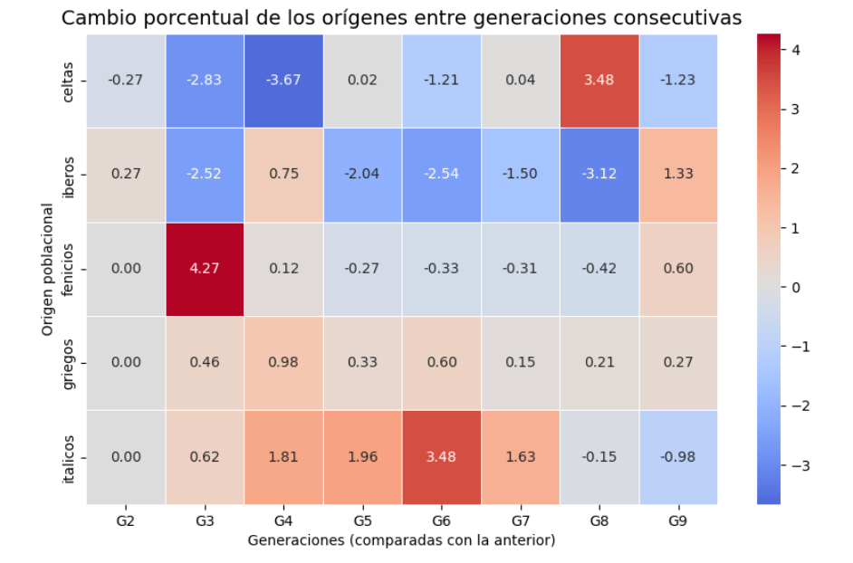
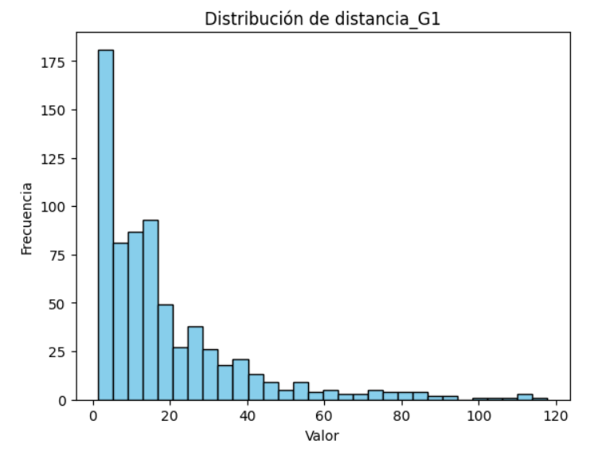
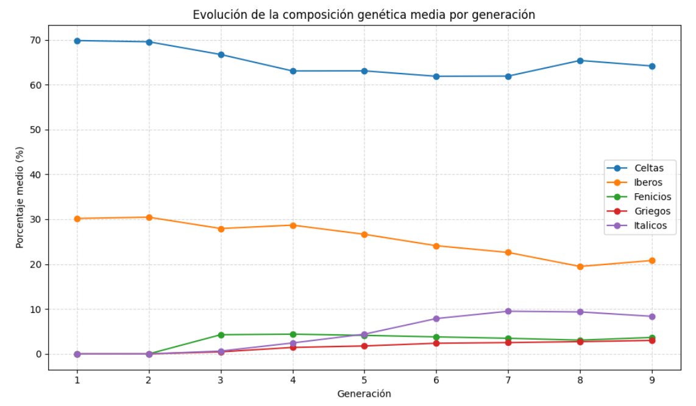
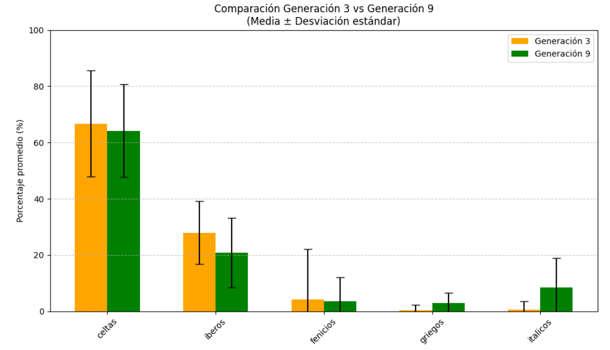
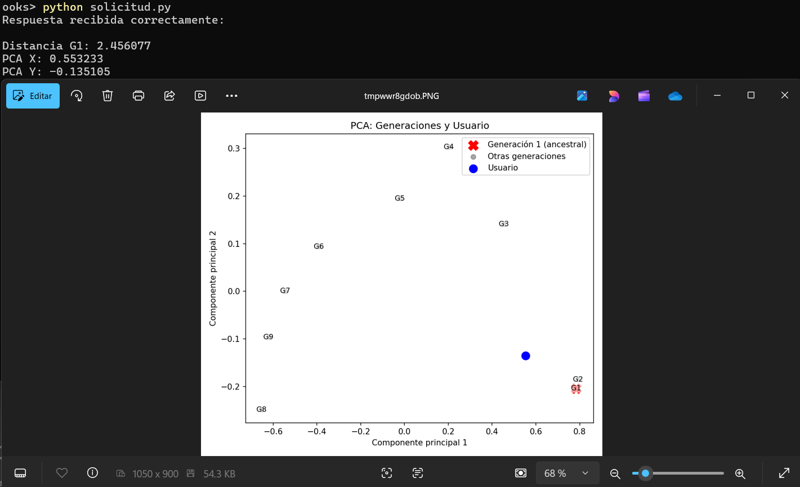

# Proyecto Aprendizaje Supervisado Regresión Genética

## Descripción  
Este proyecto de ML está hecho con la finalidad didáctica de mostrar qué hay detrás de los resultados en test de ancestrología, cómo se llega a obtener dichos resultados y cómo se pueden mostrar dichos resultados para facilitar que cualquier persona pueda entenderlos.

Para ello, a lo largo de este proyecto crearemos un dataset sintético donde, partiendo de una generación original, irán descendiendo nuevas generaciones hasta haber simulado un total de nueve generaciones. Tras ello, visualizaremos estadísticas de las mismas y calcularemos la distancia genética entre las generaciones descendientes y la generación original.

Una vez hecho eso, crearemos un modelo Gradient Boosting, el cual aprenderá los patrones que hacen que se obtengan mayores o menores distancias genéticas. Tras comprobar que el modelo funcione bien y obtenga resultados precisos, expondremos el modelo públicamente a través de una API REST para que pueda ser consultado por cualquier usuario que quiera comparar su composición genética con la de la generación original.

Finalmente, la respuesta que recibirá el usuario por parte del modelo será su distancia genética con respecto a la generación original y una imagen con la representación PCA de todas las medias genéticas generacionales, junto con la del usuario, para facilitar la interpretación de los resultados.

---

## Estructura del Repositorio  
- data/ → contiene los CSV usados a lo largo del proyecto.
- images → varias imágenes de diferentes partes de proyecto
- models/ → modelo de predicción y PCA entrenado, ambos en formato .pkl.
- notebooks/ → cuadernos .ipynb y archivo .py para probar el modelo
- .gitignore → no hacer caso.
- LICENSE → licencia.
- README.md → documentación principal.
- requirements.txt → librerías necesarias para ejecutar el proyecto.

---

## Instalación y Uso  
1. Clonar este repositorio:
   
    *git clone https://github.com/juanmacbet/proyecto-supervisado-regresion-genetica.git*
3. Entrar en la carpeta del proyecto
4. Instalar las dependencias:
   
    *pip install -r requirements.txt*
5. Seguir las instrucciones que hay en el archivo 'instrucciones.md' ubicado en la carpeta 'notebooks/' 

---

## Resultados
Como resultado de realizar este proyecto se obtiene:

- Un modelo supervisado de regresión Gradient Boosting capaz de predecir distancias genéticas con respecto a la generación original con una precisión muy elevada.
- Un servidor expuesto públicamente a través de una API REST donde cualquiera puede consultar el modelo.
- Una representación de componentes y distancias genéticas usando PCA, fácil de entender para cualquier persona.
- Un ejemplo didáctico perfecto de cómo funcionan los test de ancestrología.

### Limitaciones del análisis:
- Este proyecto está hecho con una finalidad didáctica, los datos son simulados, no tienen por qué tener rigor histórico o biológico y, sobre todo, no deben ser tomados en serio.
---

## Visualizaciones
### Cambio porcentual generacional:  

### Distribucón Variable Objetivo en el entrenamiento del modelo:  

### Evolución Genética Generacional:  

### Respuesta final tras consultar al modelo a traves de la API:  

---

## Tecnologías Utilizadas

- **Python** → Lenguaje principal usado a lo largo de todo el proyecto.
- **Visual Studio Code** → Entorno de desarrollo utilizado para escribir el .py para hacer la consulta al modelo a través de la API.
- **FastAPI** → Framework ligero y eficiente para crear la API REST
- **Google Colab** → Entorno en la nube para la simulación de generaciones, la ejecución del modelo y el despliegue de la API.
- **Uvicorn** → Servidor ASGI utilizado para ejecutar la aplicación FastAPI.
- **Ngrok / Pyngrok** → Herramienta para exponer el servidor local de Colab a Internet mediante un túnel seguro.
- **Pandas** → Manipulación y análisis de datos a lo largo de todo el proyecto.
- **NumPy** → Operaciones numéricas y manejo de matrices.
- **Scikit-learn** → Librería principal para machine learning donde se incluyen diferentes cosas imprescindibles en este proyecto, por ejemplo para la normalización de datos (**StandardScaler**), para la reducción de dimensionalidad y visualización (**PCA (Análisis de Componentes Principales)**), y para el entrenamiento y predicción de la distancia genética (**Modelos de regresión** y **Gradient Boosting**)
- **Matplotlib / Seaborn** → Generación de visualizaciones y análisis gráfico de resultados.
- **Pillow** → Manipulación de imágenes generadas por el modelo.
- **Requests** → Pruebas y consumo de la API desde Python.
- **Git & GitHub** → Control de versiones y publicación del proyecto.

---

## Autor  

- **Juan Manuel Cano Betancourt**
- [GitHub](https://github.com/juanmacbet)
- [LinkedIn](https://www.linkedin.com/in/juan-manuel-cano-betancourt-1887401b7/)
- [Email](mailto:juanmacanobetancourt@gmail.com)

---

## Licencia

Este proyecto está bajo la licencia [MIT](./LICENSE).
